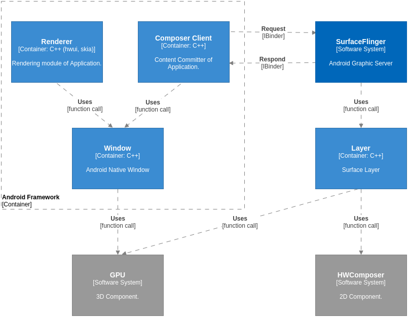
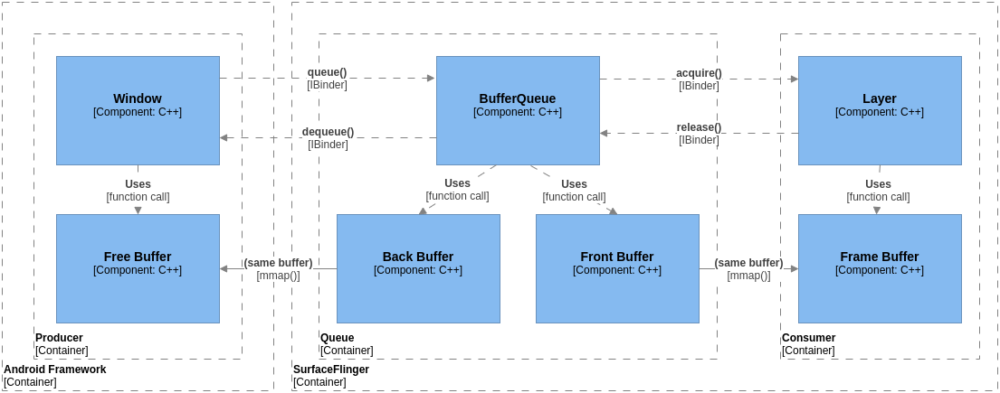
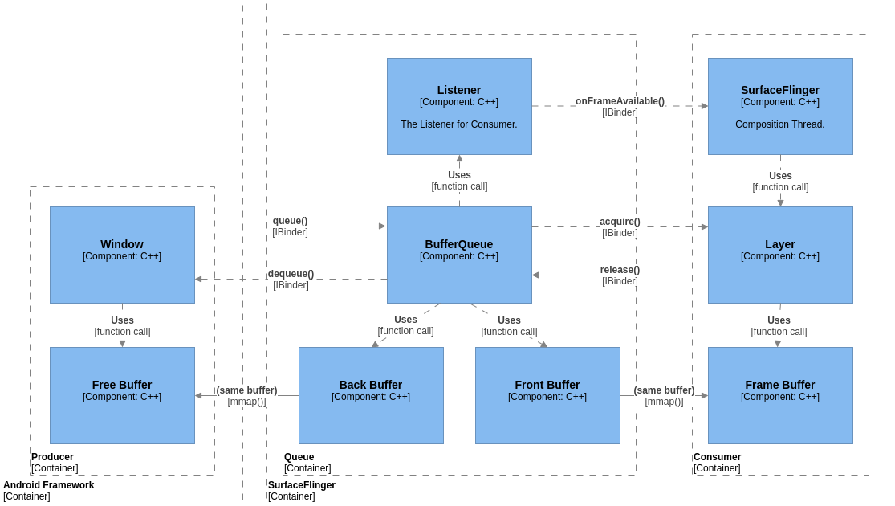
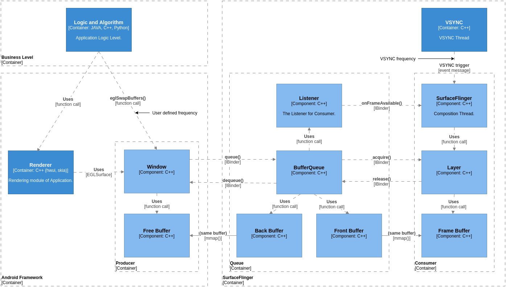
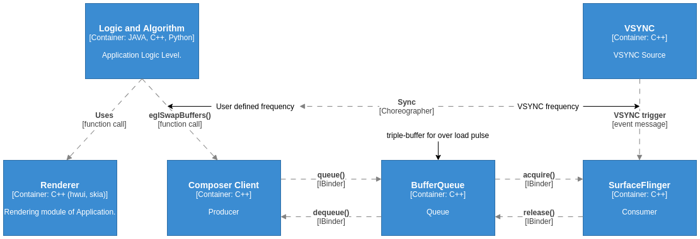
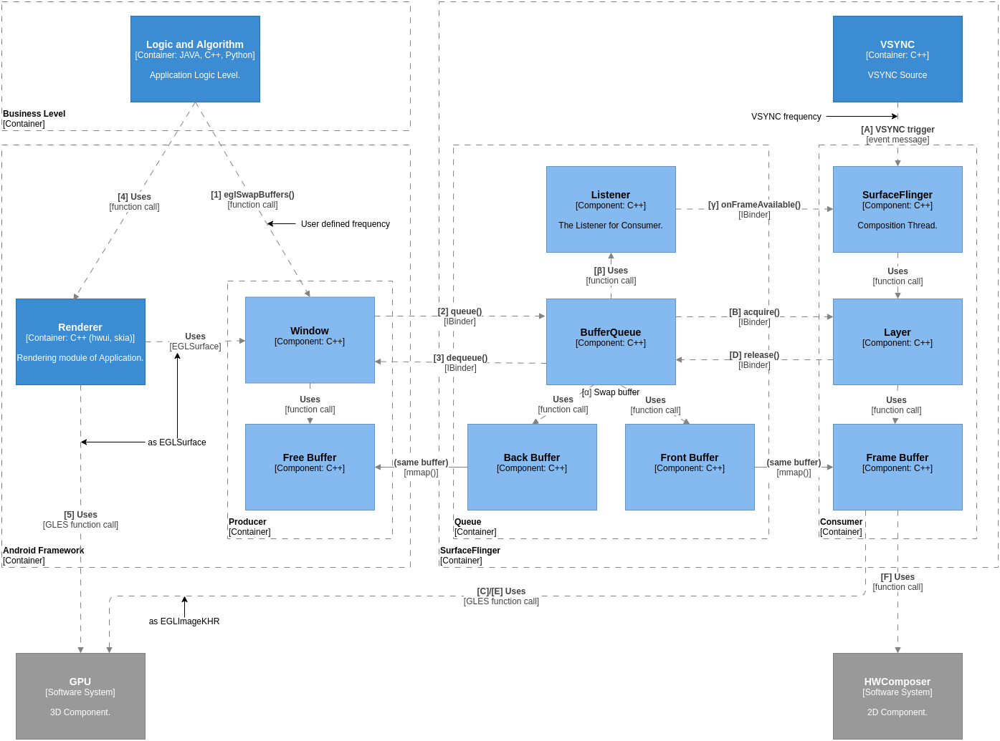
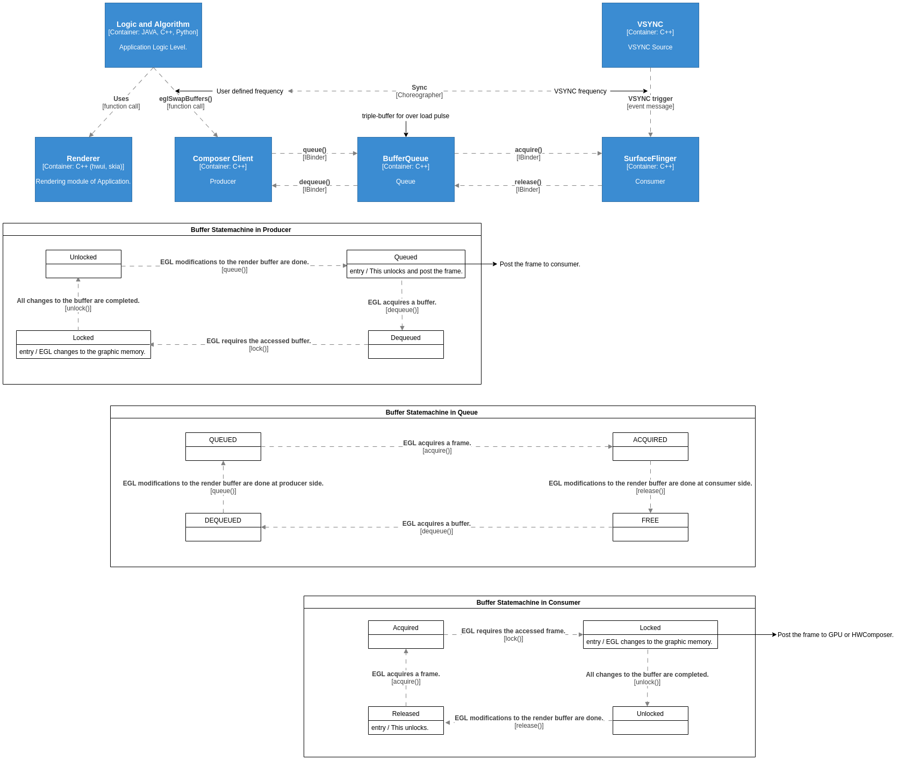
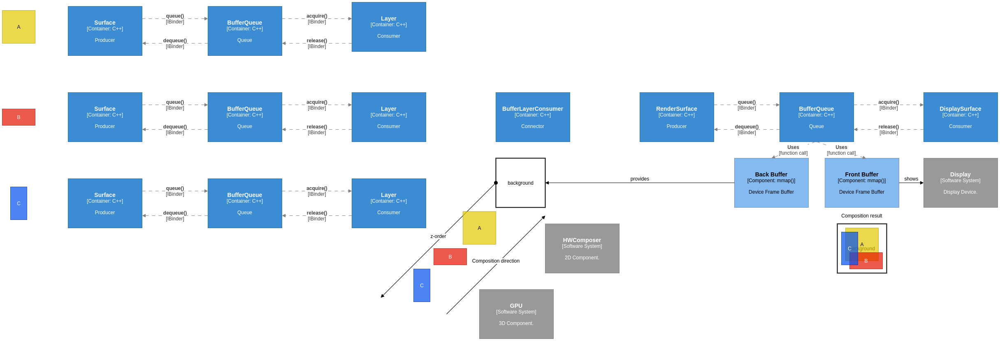
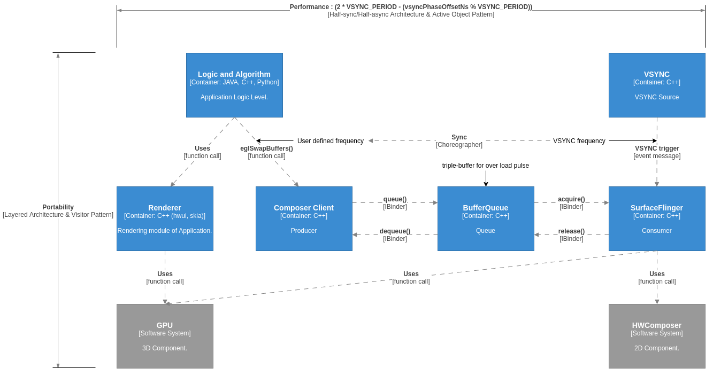

# 重大技术决策
* * *

本文用容器图(Container)体现 Android 图形系统的一些重大技术决策。

# 采用硬件加速

从前面的语境图可知，Android 图形系统是基于硬件加速模块进行设计的。更具体的说，Android 图形系统，是针对多核、异构的硬件进行设计的。
* CPU 有多核，所以可以设计多线程/进程协作架构。
* 能够绘图的设备有 CPU / GPU / codec / camera 等。
* 能够合成(Composition)图像的设备有 CPU / GPU / HWComposer。
* 需要考虑并发设计，以便使得挂在从绘图到显示这个路径上的各个设备都可以满负荷工作。减少设备忙等待的时间。

# 采用本地渲染策略

Android 图形系统的另外一个重大技术决策是采用本地渲染策略。在传统的图形系统中，例如 X Server，采用的是集中服务的策略，也就是在 Grahpic Server 一端做完所有一切。这样做的问题是服务器一端的软件又负责又不可靠，并且不能满足客户端各式各样并且求新求变的需求。

Android 图形系统将绘图算法库移动到客户端，由应用软件选择和自行调用。这样的好处有： 
* Grahpic Server 只实现合成功能，它就可以变小而易于维护，而绘图算法库可以单独升级而不影响服务器。 
* 应用软件可以按照需求，选择合适的图形库，例如，选择 cairo / skia / hwui 等图形库。 

最终，Android 图形系统在设计上最基本的思路和功能就是： 
* 客户端完成绘图或渲染功能。特点是采用 GPU 绘图或渲染，为此在 EGL / OpenGLES 方面提供了基于 Android 的扩展。经典的实现是 skia 和 hwui 库。 
* 服务端实现完整的合成功能。标志是提供了完整的矩阵变换、Porter-Duff 合成算法、颜色空间转换功能。 

# 面向 BufferQueue 的设计

图形系统的直接操作对象是窗口(Window)。



这是一种对称设计，在 Client 端有一个窗口(Window)的抽象，在 Server 端有一个 Layer 对应。Android 图形系统总体上是一种 Client / Server 架构，在设计模式上是 Producer-Consumer 模式，由 Client 端生产内容，由 Server 端消费内容。

我们针对窗口系统的 Producer-Consumer 模式进行细化。我们先看在图形系统中一个窗口的抽象设计。见下图。


一个窗口一般会分成两个部分：一个窗口本身的管理结构(struct)，一个是可以存放绘图内容的内存块，一般称为缓冲区(buffer)。在习惯上，一般在讨论这块内存本身的特性和功能时，会称之为缓冲区(buffer)；如果内存上面已经带有内容(content)，则称之为帧(frame)。 

Android 图形系统是多线程/进程协作架构，为了使得 Client / Server 两端时刻都满负荷运作而不陷入忙等待，所以，在窗口系统的设计中，采用双缓冲(double-buffer)是很自然的事情。在双缓冲(double-buffer)方案里： 
* 一个窗口的有两个缓冲区(Buffer)：front buffer & back buffer。 
* 客户端把刚刚渲染完的帧(Frame)标记为 front buffer，另一个 buffer 等服务端合成完以后则为 back buffer。客户端在 back buffer 进行新的渲染。
* 为了管理多个 buffer，在流水线中间插入一个管理队列(Queue)，形成 Producer-Queue-Consumer 模式。
* 在每一个显示周期，两者通过 BufferQueue 交换 front buffer & back buffer。



当 Producer 端将一个帧(frame)插入队列(Queue)后，为了使 Consumer 端尽快处理该帧，需要给其发送消息 onFrameAvailable()，需要使用 Observer 模式，该设计模式又称 Listener 模式，经常与 Producer-Consumer 模式相组合。



在 Android 图形系统中经常采用对称设计，但是在这个 Listener 模式的实现中，针对 Producer 端的 Listener 类并没有被使用。因为在 Android 图形系统流水线中，Free Buffer 的含义相当微妙。并不是说当 Consumer 端通过 release() 方法将 buffer 放入队列(Queue)后，buffer 就成为 free 状态。相反，为了尽可能发挥并行效率，在 Consumer 端的线程，将 CPU 能做的事情做完后，将 frame 交给了 GPU 之后，就会将该 buffer 的管理数据结构通过 release() 方法退回给 Queue，使得 Producer 端的线程无需长时间陷入忙等待就获得一个虚拟的 free buffer。因为如果幸运的话，因为线程的切换，当 Producer 端的线程被激活并获得一个 buffer 时，有一定的时间，并且线程还会运行一些管理代码，也需要一些时间，当该线程真正需要将内容写入 buffer 时，也许 GPU 就已经使用完该 buffer，于是该 buffer 就已经成为真正的 free buffer。这样，利用多核异构的并发特性，整个系统的利用率最高。

因为流水线太长，buffer 的用户太多，这时已经无法使用队列(Queue)的 Listener 机制进行同步。于是 Android 设计了另外一种伴随着 buffer 的主动同步机制，Fence 机制。该机制可以认为也是一种 Listener 模式，它代表着它所伴随的 buffer 的 busy / free 状态。当在流水线上的任何一个模块要**真正地读或写**某一个 buffer 时，都需要主动查询该 buffer 的 busy / free 状态。当查询接口阻塞时，代表有其它模块正在使用该 buffer。当查询接口返回时，说明该 buffer 为真正的 free 状态，并且所有权已经属于该模块，则要使用 buffer 的模块要做的第一件事情就是关闭原先老的 Fence，生成新的 Fence 伴随该 buffer，这就代表着该模块正在占用该 buffer，直到工作完成，该模块关闭自己的 Fence，让其它模块的 Fence 查询接口得以返回，这就代表着该 buffer 的所有权已经转移到新的模块上。这种机制有利于并发模型。

# BufferQueue 的驱动力

这个 Producer-Queue-Consumer 模型的驱动力来自于两个驱动时钟：
* Producer 端的用户定义频率
* Consumer 端的 VSYNC 频率



* 在 Producer 端提交内容的触发条件是应用代码调用 eglSwapBuffers() 函数。因此用户调用 eglSwapBuffers() 函数的频率就是 Producer 端的驱动时钟。这个时钟可以不定时。
* 在 Consumer 端的触发条件是 VSYNC 信号。这是一个相对稳定的时钟。
* 这两个时钟可以不一致、不同步。但是，如果 Producer 端以 100Hz 频率生产内容，而 Consumer 端以 60Hz 频率消费内容，中间就有很多帧的内容被抛弃。这样做既消耗系统资源也无意义。
* 因此，VSYNC 频率和用户定义频率需要同步，以有效且平滑地生产并显示内容。这就是 Android 图形系统中的编舞者(Choreographer)机制。 



* 此外，BufferQueue 也对协调生产和消费这两种频率起着积极作用。因此 Android 图形系统中的 BufferQueue 是一种自适应的三缓冲(triple-buffer)设计。
* BufferQueue 对于 Producer 端，在从 buffer pool 中按照 Buffer ID 的最小编号选取。
  - 这可以使得申请的 buffer 的个数最小。
  - 相应的，也使得已申请的 buffer 尽快被复用到，使得新帧可以尽快被显示出去，延时最小。
  - 如果消费速率远大于生产速率，则可以变成 single-buffer 模式，消耗内存最少。
  - 一般情况下，消费速率与生产速率相当，就变成 double-buffer 模式。
  - 偶尔有性能的波动，消费速率小于生产速率，就变成 triple-buffer 模式。用空间换时间，减少生产端的阻塞。
  - triple-buffer 模式有一个缺点：新帧需要多一个 VSYNC 周期才能显示出去，所以显示延时会变大。
  - 当过一段时间，消费速率与生产速率相当以后，根据最小编号选取的算法，BufferQueue 又会变成 double-buffer 模式，减少显示延时。

这个 Producer-Queue-Consumer 模型的操作步骤执行顺序如下：



因为这是一个多进程/多线程的协作系统，这三个模块是分别在不同的进程/线程中并发运行。

Producer 端的循环我们可以认为是从调用 eglSwapBuffers() 函数开始：
1. 业务代码调用 eglSwapBuffers() 函数，表示当前内容生产已经结束，需要将其显示到屏幕上。
2. Window 将 frame buffer 调用 queue() 方法插入 BufferQueue 队列。
3. Window 调用 dequeue() 方法从 BufferQueue 空闲队列取回一个 free buffer。
4. 业务代码调用渲染函数生产内容。
5. Window 是以 EGLSurface 接口提供给 OpenGLES 模块使用。渲染函数使用 OpenGLES 函数生产内容。

Queue 的循环有：
* α. 交换 back / front buffer。
* β. BufferQueue 调用 Listener 发消息。
* γ. Listener 将 onFrameAvailable() 消息跨线程发给 SurfaceFlinger。注意，此时 SurfaceFlinger 并没有启动合成任务，在此上下文中，它只是将已被修改的帧的编号记录下来。

Consumer 端的循环有：
* A. VSYNC 消息到达，SurfaceFlinger 启动合成任务。
* B. Layer 调用 acquire() 方法获取已被修改的帧。
* C. 已被修改的帧做为 EGLImageKHR 绑定到一个 Texture / FBO ID 上。原先绑定的 EGLImageKHR 被顶出来成为 free buffer。
* D. Layer 调用 release() 方法将 free buffer 退回 BufferQueue。
* E. Layer 调用 OpenGLES 函数合成部分 buffer 的内容。
* F. Layer 调用 HWComposer 函数合成剩余的 buffer 的内容，并将总的合成内容显示到屏幕上。

在 Producer-Queue-Consumer 模式中，当 buffer 数量有限时，两端的驱动频率自然地由 Queue 阻塞而得以协调。大致的时序图如下：

| No. | Producer         | No. | Queue              | No. | Consumer         |
|:---:|------------------|:---:|--------------------|:---:|------------------|
| 1   | eglSwapBuffers() |     |                    |     |                  |
| 2   | queue()          |     |                    |     |                  |
|     |                  | α   | Swap buffer        |     |                  |
|     |                  | β   | Call Listener      |     |                  |
|     |                  | γ   | onFrameAvailable() |     |                  |
|     |                  |     |                    | A   | VSYNC trigger    |
|     |                  |     |                    | B   | acquire()        |
|     |                  |     |                    | C   | Bind EGLImageKHR |
|     |                  |     |                    | D   | release()        |
|     |                  |     |                    | E   | Call OpenGLES    |
|     |                  |     |                    | F   | Call HWComposer  |
| 3   | dequeue()        |     |                    |     |                  |
| 4   | Call Renderer    |     |                    |     |                  |
| 5   | Call OpenGLES    |     |                    |     |                  |

Android 图形系统是多进程/多线程协作的并发系统，为了减小阻塞，Producer/Consumer 两端需要采用尽快交付策略，也就是利用上一节所讨论的 Fence 机制。Producer 端的 CPU 处理完渲染配置事务后，不必等 GPU 渲染完成，就可以将 frame buffer 交付给 Queue。Consumer 端取出 frame buffer 后，在**真正读取**内容前，会检查伴随的 Fence，如果 GPU 还没有渲染完成，自然陷入等待中，直到渲染完成就自动返回，Consumer 端就可以做后续的合成工作。当 Consumer 端处理完合成配置事务后，不必等待 GPU/HWComposer 合成完成，就可以将 free buffer 交付给 Queue。Producer 端得到 free buffer 后，在**真正写入**内容前，会检查伴随的 Fence，如果还有用户还在读取该 buffer 中的内容则陷入等待，直到读取完成就自动返回，Producer 端就可以做后续的渲染工作。通过 Fence 机制，充分利用了系统的多核异构的并发特性，有效地减小了 buffer 在流水线中的阻塞时间。

编舞者(Choreographer)进行 Producer/Consumer 两端频率的协调之后，图形流水线运转得更顺畅。不过同步并发也会带来一个新的问题，Producer 端的第 4 步可能会和 Consumer 端的第 E 步竞争 GPU 资源，Consumer 端的第 F 步可能会和底层显示驱动竞争 HWComposer 资源。因此频率协调之后，Producer/Consumer 两端的执行时间点需要有相位偏移(phase offset)，这将在后面讨论。

# Buffer 的状态机

在图形流水线上流动的工作介质是 buffer。为了进一步理解这个 Producer-Queue-Consumer 模型的运行原理，我们需要了解 buffer 在流水线上这三个部位中不同的状态变化。



* 在 Producer 中有 4 种状态：
  + Queued
  + Dequeued
  + Locked
  + Unlocked
* 在 Queue 中有 4 种状态：
  + QUEUED
  + ACQUIRED
  + FREE
  + DEQUEUED
* 在 Consumer 中有 4 种状态：
  + Acquired
  + Locked
  + Unlocked
  + Released
* 在保持 Locked 状态期间是 GPU / HWComposer 读写 buffer 的时间。
* 在 Queue 中是自然调节 Producer/Consumer 两端的驱动频率的地方：
  + 在 Queue 中的 QUEUED/DEQUEUED 状态与在 Producer 中的 Queued/Dequeued 状态同步。
  + 在 Queue 中的 ACQUIRED/FREE 状态与在 Consumer 中的 Acquired/Released 状态同步。
* 通过 Fence 机制，有效地减小了 buffer 在状态变化中的阻塞时间。

# 2-stage 流水线

在前面讨论的设计，是基于单窗口的设计，所以显示流水线只需要一个 BufferQueue 。但如果考虑多窗口的设计，则显示流水线又会多一个阶段。

下面是显示流水线示意图。在这里，我们用 Android 中具体的 Surface 类代替 Window 这个抽象概念，其它模块也类似。假如我们有 A/B/C 三个窗口分别由三个独立的进程绘制。它们在同一个时段都提交了新内容请求显示。在 A/B/C 三个应用中，它们不关心自己窗口的遮盖情况，它们只关心有多大的 Surface 供它们绘制。Surface 之间的遮盖关系，或者常说的 z-order，由 WindowManager 维护，由 SurfaceFlinger 在合成时应用。因为根据 z-order 进行合成操作，实际上就是产生了新的内容，因此需要一个两阶段(2-stage)的显示流水线，每个阶段的核心都是 BufferQueue。两个阶段之间的连接，是一堆围绕着 BufferLayerConsumer 而设计的类，下图进行了简化。



以 BufferQueue 为中心，就有两个对称的概念：
* Surface-Layer，一个窗口有一对。
* RenderSurface-DisplaySurface，一个显示设备有一对。

每一对 Surface-Layer 存在一个 BufferQueue，对应一个应用窗口。而多窗口系统有很多个 Surface 同时存在，并且应用程序绘图的节拍由各自调用 eglSwapBuffers() 函数的频率决定。图形显示节拍，每一对 RenderSurface-DisplaySurface，对应一个显示设备，存在一个 BufferQueue，只在 surfaceflinger service 内部存在。显示设备一般较少，大多数情况下只有一个且必然要存在一个显示设备，否则 Android 系统无法启动。图形显示节拍由 VSYNC 决定，如果存在多个显示设备，则只由主显示设备的 VSYNC 决定。

这时候又回到前面的话题，如果多个窗口的刷新频率能和 VSYNC 同步，则显示会更顺滑。这就是编舞者(Choreographer)机制要解决的问题。这在后面讨论。

在合成(Composition)操作期间，需要对 z-order 中的 Dirty Layer 进行三次扫描。第一遍是从底到顶扫描，记录每个 Layer 暴露的区域，并且标记各个 buffer 用哪个设备合成更合适(GPU or HWComposer)。这是因为根据内容格式和尺寸的不同，还有根据各个厂商硬件的不同，有些 buffer 适合用 GPU 合成而有些适合用 HWComposer 合成。第二遍是从顶到底扫描，对合适的 buffer 用 GPU 进行合成操作，第三遍也是从顶到底扫描，对剩余的 buffer 用 HWComposer 进行合成操作。

显示的最关键操作就是在 z-order 的最底层插入了由第二阶段的 BufferQueue 提供的 back buffer，该 buffer 实际上是 device frame buffer，写在上面的内容可以显示到屏幕上，条件是从 back 变成 front 状态。这样，back buffer 就承接了合成结果，并在下一个 VSYNC 到来时交换为 front buffer 并显示在屏幕上。

所以第二阶段的 BufferQueue 有点特殊，它只管理 device frame buffer，并且固定只有 back & front 两个 buffer，因为这样设计可以保证最小的显示延迟。当然，如果这条流水线是虚拟显示设备，则可以是普通的 buffer，后面的流水线还附加有更多的处理模块，如编码模块和WIFI模块等等。

因此，两阶段(2-stage)的显示流水线设计，使得正在显示过程中的内容不会被修改而产生撕裂效果。从 buffer 在流水线中的应用可以看出，在同一时刻，一个 buffer 只有一个应用方向，**要么只写(write only)要么只读(read only)**，这是通过大家都主动使用主动式同步接口(Fence)来保证的。

# 编舞者(Choreographer)的设计

当每个窗口渲染的频率和 surfaceflinger 的合成频率以 VSYNC 信号同步以后，会出现对 GPU / HWComposer 的集中式爆发使用。这样的设备竞争不利于平滑显示。所以 Android 图形流水线的执行时间点需要有相位偏移，这是编舞者(Choreographer)的设计细节。

Choreographer 框架要协调 3 类事件的周期启动时间：
1. HW_VSYNC_0 - 屏幕开始显示一帧内容。
2. VSYNC - 应用提交已生成帧，并开始生成下一帧。
3. SF_VSYNC - SurfaceFlinger 开始为已生成帧进行合成。

这 3 类事件如果在同一时间点爆发，就会造成系统堵塞。于是这 3 类事件需要交错启动。同时，还要考虑应用提交的已生成帧，需要在最短的时间内显示到屏幕上。于是 VSYNC 的相位偏移信号因需而生。

其中，HW_VSYNC_0 对应的是硬件 VSYNC 信号，是时间基准。需要协调的是 VSYNC 和 SF_VSYNC 相对于 HW_VSYNC_0 的相位偏移。相位偏移量需要从高负载的场景进行设置。


因为高负载的软件，很可能在一个周期时间里是完不成绘制一帧的工作的。因此在实际项目里，要确保的是 SurfaceFlinger 的合成工作，在系统高负载的情况下，在一个周期时间里一定能完成。这样，在多进程/线程的工作环境里，在上一个周期时间能提交新的绘制内容的窗口，将在下一次 HW VSYNC 信号到达时能显示出去。所以，SurfaceFlinger 的合成工作，比应用的绘制工作要先启动，这样合成操作在一个周期时间里有更多的工作时间和资源。

所以，应用软件预测现在开始绘制的帧如果能在一个节拍内完成，要显示到屏幕上的最小延迟就是这个公式：
```C++
(2 * VSYNC_PERIOD - (vsyncPhaseOffsetNs % VSYNC_PERIOD))
```

所以，在一个 VSYNC 时间节拍中，就有了这样的显示管线：显示设备开始显示帧 N，而 SurfaceFlinger 开始为帧 N+1 合成窗口，应用处理等待的输入并生成帧 N+2。这是通常情况。

更多的设计细节在相关的类的协作图中讨论。

# 重要的品质属性

软件架构设计所关注的品质属性(Quality Attributes)有很多项。这里我们从总体上关心两项：
* 性能(Performance)指标
* 可移植性(Portability)

从软件架构看，性能(Performance)指标是时间横轴的约束，可移植性(Portability)是架构纵轴的约束。



性能(Performance)指标是显示最小延迟公式：
```C++
(2 * VSYNC_PERIOD - (vsyncPhaseOffsetNs % VSYNC_PERIOD))
```

也就是，如果一个应用在 VSYNC 信号到达时开始渲染一帧内容，如果它能在一个 VSYNC 节拍内完成渲染工作并提交，则该帧能在从现在算起的两个 VSYNC 节拍内被显示到屏幕上。这是一个实时显示的要求，在游戏或 VR 中就有很好的操作跟随性。

Android 图形系统软件架构，从总体上看是一种半同步/半异步(Half-sync/Half-async)架构。从设计模式看，是 Producer-Consumer 模式的变种，Thread Pool 模式，更进一步的，是其变种，Active Object 设计模式。之所以采用这么复杂的设计模式，就是为了充分利用多核异构架构，实现更好的性能。

从系统架构的纵向看，则是一个多层架构，大致可以分为：

0. Application
1. Framework Interface
2. Framework Implementation
3. Framework Internal
4. HIDL Interface
5. HIDL Implementation
6. HAL Interface
7. HAL plugin

之所以采用这么复杂的分层模式，主要就是为了兼容性，使得 Android 可以在各种平台，各种硬件配置，各种时代的驱动软件上可以运行。特别是 HIDL 层代码，HAL Interface Definition Language (HIDL)，其实就是在 Framework / HAL 两层之间的一个适配层，并且使得接口和实现可以跨进程分布。HIDL 层的实现，所采用的设计模式为访问者模式(Visitor Pattern)。

# 对称设计


