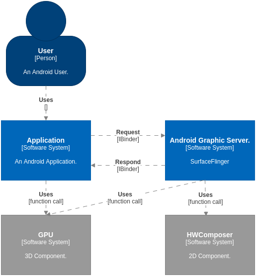

# 所要研究的对象

比起其它基于网络服务的大型系统来说，基于本地的 Android 图形系统的语境图(Context)相当简单。用户只和图形界面的应用软件打交道。图形应用软件背后会和一个 Graphic Server 打交道。两者都有硬件加速支持。

我们针对应用软件的图形模块进行放大，得到下图：

图形模块可以简单地分成上下两层，逻辑层和执行层。逻辑层由开发应用的团队负责，依需求不同而各式各样。执行层位于 Android Framework 层中，具有通用性。其功能又可分为先后执行的两个部分：
* 渲染模块(Renderer)。就是给窗口画点、线、面，或者渲染图像的模块。如果应用没有自行实现，则底层就采用 Android 现有的模块：hwui / skia。
* 合成模块(Composer)。就是将多窗口的内容合成并显示在屏幕的模块。这个功能主要由著名的 SurfaceFlinger 软件完成。

本系列文章主要分析合成模块(Composer)，如图中的阴影区块所示。渲染模块(Renderer)是另外一块不亚于本系列的大块头，留待以后有机会再说。
